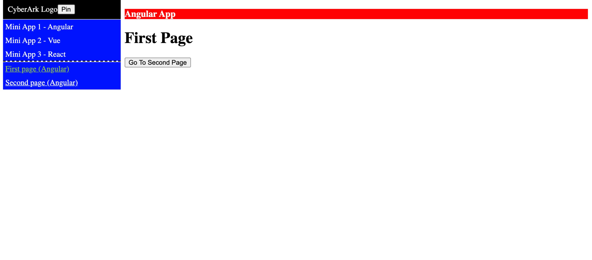
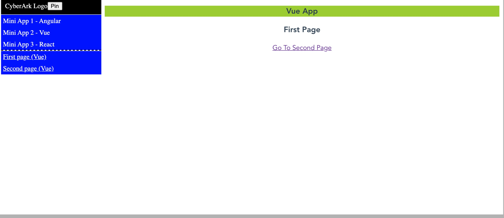
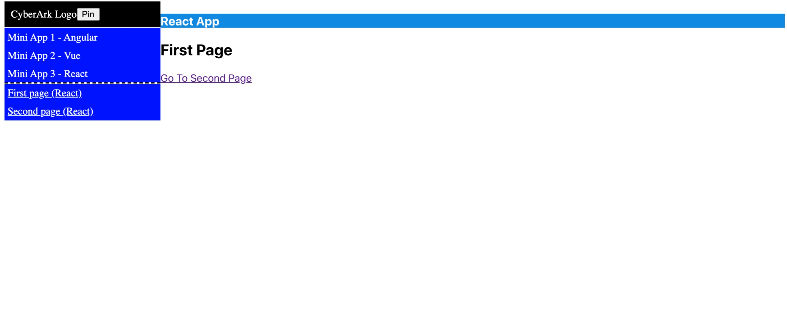
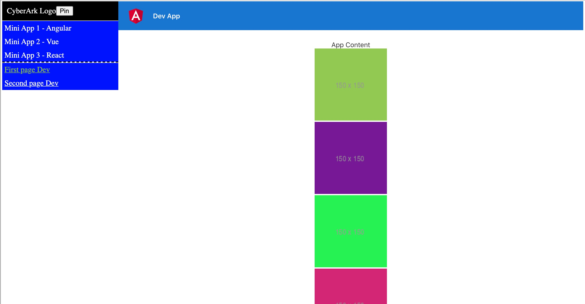

# POC3-MFE-iFrame

## Overview

This iFrame POC 3 is:

<b>In this app there is 5 different application:</b>

1. shell ui - Angular
2. mini app 1 - Angular
3. mini app 2 - Vue
4. mini app 3 - React
5. dev app - For Local Developer Scenario - Angular

## Features

1. Navigation automatic management- Outer and Inner Route in applications
2. Side Nav

- Show side nav current active link
- Click capabilities to replace apps and inner navigation on apps

3. Communication - from the shell to apps and vice versa
4. Pop Up on shell
5. Browser URL sync with current location of the app
6. Shell For dev: 3 solutions

- Shell For Dev Web Component
- Chrome Extension
- Query Param change to dev app on the fly

## Shell For Dev

<b>There are 3 solutions that we think about:</b>

1. <b>Shell UI Web Component</b>

- Idea:
  - Create a shell ui web component in each PR.Developers can see there local env inside the shell by using the shell ui web component.
- How:
  - In Developer Machine with IndexShellDev.html
    - Part of the CI, the Shell UI Web Component will build and deploy to some specific bucket (with versioning)

2. <b>Shell UI - Browser Extension (Check From Security POV)</b>

- Idea:
  - Create a browser extension ONLY for developers that will enable/disable it on production env.
- How:
  - The extension will Redirect Requests and change Response and Headers on Production Env
  - Can also hold Auth cookies

3. <b>URL Query String Change on Production/Dev Env</b>

- Idea:
  - insert in production or development env a dev mode query param with dev url host. Shell will know in which "mode" it run and load the correct env
- How:
  - insert devMode and devUrlHost query param to URL
  - Example: http://localhost:4200/mini-app1/first-component?devMode=true&devUrlHost=http://localhost:3000

## Screen Shots

<b>Shell UI - Angular</b>

<b>Shell UI - Vue</b>

<b>Shell UI - React</b>

<b>Shell UI - Dev Mode</b>

